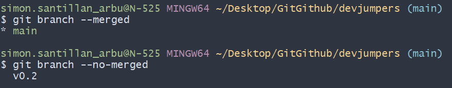
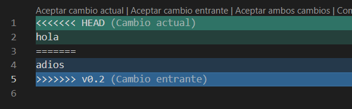
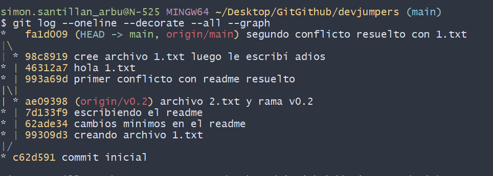

# Ejercitación final - aprendiendo Git y GitHub

## Creando y clonando repositorio
Creo mi repositorio en GitHub utilizando el botón new y luego para clonarlo traigo el link de mi repositorio remoto (GitHub) a mi CLI GitBash para guardarlo de manera local con el comando `$ git clone <link-de-mi-repositorio>`.

## En local
Una vez hecho lo anterior entro a mi repositorio local desde la consola. (mi repositorio local se llama devjumpers)
``` 
$ cd devjumpers
```
Abro Visual Studio Code desde la consola
``` 
$ code .
```
Creo el archivo README desde la consola
``` 
$ touch README.md
```
Añado al área de ensayo el archivo README.md
``` 
$ git add .
```
Hago un commit inicial
``` 
$ git commit -m "commit inicial"
```
Subo los cambios hechos a mi repositorio remoto
``` 
$ git push
```
## Ignorando archivos

Creo en mi repositorio local un archivo llamado `privado.txt`
``` 
$ touch privado.txt
```
Creo en mi repositorio local una carpeta llamada **privada**
``` 
$ mkdir privada
```
Creo el archivo `.gitignore` para decirle a git que archivos y carpetas ignorar
``` 
$ touch .gitignore
```
Le digo a Git que ignore el archivo llamado `privado.txt` (Para esto escribo el nombre del archivo y lo guardo en el archivo de texto .gitignore)
``` 
$ echo "privado.txt" > .gitignore
```
Le digo a Git que ignore la carpeta llamada **privada**
``` 
$ echo "privada" >> .gitignore
```

## En local

Añado el archivo `1.txt` a mi repositorio local.
``` 
$ touch 1.txt
```
Luego de commitearlo lo subo a mi repositorio remoto
```
$ git push
```

## Crear una rama

Crear una rama llamada **v.2**
``` 
$ git branch "v0.2"
```
Posiciono mi carpeta de trabajo a esa rama
``` 
$ git checkout v0.2
```
## En local

Añadir un archivo `2.txt` en la rama **V0.2**
```
$ touch 2.txt
```
Comiteo los cambios hechos y luego subo los cambios a mi repositorio remoto
```
$ git push --all
```

## Merge directo

Me posiciono en mi rama **main**
``` 
$ git checkout main
```
Fusiono las ramas
``` 
$ git merge v0.2
```
## Merge con conflicto

Coloco "hola" en el archivo `1.txt` de la rama principal
```
$ echo "hola" > 1.txt
```
Me posiciono en la rama **v0.2** y escribo "adios" en el archivo `1.txt`
```
$ echo "adios" > 1.txt
```

## Lista de ramas fusionadas y no fusionadas



## Resolviendo conflictos



En síntesis creé un conflicto y lo resolvi mediante VSCode borrando el mensaje de conflicto y dejando el código que quería, después lo comitee en la rama principal y desapareció el conflicto. (Lo mismo hice con el conflicto que tuve con los README.md)

Una vez resuelto el conflicto borre la rama **v0.2**
```
$ git branch -d v0.2
```

## Listado cambios



## Tabla de compas

| NOMBRE | GITHUB |
|--------|--------|
|Aylen|https://github.com/Loreaylen|
|Valeria|https://github.com/valeriazacariasl|
|Santiago|https://github.com/Luvwen|